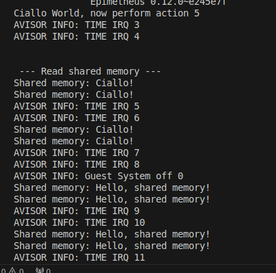
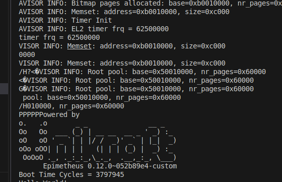
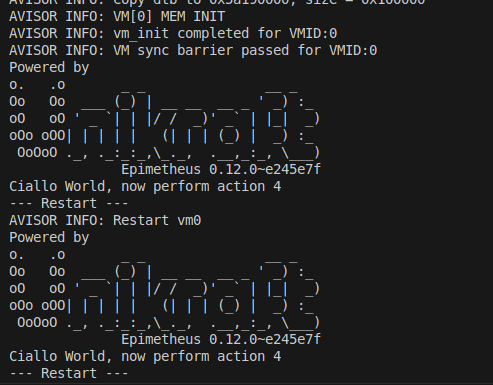

## 额外完成的工作

### 1. 实现了虚拟机间的共享内存通信

我的想法是将共享内存视为一种设备。在加载虚拟机时，将该设备映射到虚拟机的内存空间中，从而实现共享内存通信。

具体地，我定义了`shared_memory_device`结构体，用于描述共享内存设备，其定义如下：

```c
struct shared_memory_device {
    vaddr_t va;     // 虚拟地址
    paddr_t pa;     // 物理地址
    size_t size;    // 大小
};
```

在Hypervisor初始化过程中，我分配了一块物理内存，并在虚拟机初始化过程中，将这块物理内存映射到虚拟地址空间中。这样，虚拟机可以通过访问这个虚拟地址来访问共享内存。Hypervisor的初始化代码如下：

```c
// 初始化共享内存
void shared_memory_init() {
    shared_mem = (struct shared_memory_device*)mem_alloc_page(NUM_PAGES(sizeof(struct shared_memory_device)), false);
    shared_mem->va = SHARED_MEM_BASE;
    shared_mem->size = SHARED_MEM_SIZE;
    
    // 分配物理内存
    shared_mem->pa = (paddr_t)mem_alloc_page(NUM_PAGES(shared_mem->size), false);
    if (shared_mem->pa == 0) {
        ERROR("Failed to allocate shared memory.");
        return;
    }

    // 测试用
    memcpy((char*)shared_mem->pa, "Ciallo!\0", 8);

    INFO("Shared memory initialized: va=0x%x, pa=0x%x, size=0x%x", shared_mem->va, shared_mem->pa, shared_mem->size);
}
```

虚拟机初始化代码如下：

```c
// 初始化虚拟机设备
static void vm_init_dev(struct vm* vm, const struct vm_config* config) {
    // ....

    // 初始化共享内存设备
    if (shared_mem != NULL) {
        mem_alloc_map_dev(&vm->as, (vaddr_t)shared_mem->va, shared_mem->pa, NUM_PAGES(shared_mem->size));
    } else {
        WARNING("No shared memory device");
    }      
}
```

这样，虚拟机就可以通过访问`shared_mem->va`来访问共享内存（在这里，这个虚拟地址被设定为了`0x70000000`，可以在`mem_cfg.h`中修改）。

#### 验证

我在`Avisor`中配置了两台虚拟机，一台虚拟机写入共享内存，另一台虚拟机读取共享内存。在虚拟机1中，我让其每隔1秒从共享内存中读取数据并打印出来；在虚拟机2中，我让其在5秒后向共享内存中写入数据。通过这种方式，我验证了共享内存通信的正确性。

虚拟机1的核心代码如下：

```c
#define SHARED_MEM_BASE 0x70000000

// ...

char *shared_mem = (char *)SHARED_MEM_BASE;
sleep(2);
printf("\n\n --- Read shared memory ---\n");
while (1) {
    printf("Shared memory: %s\n", shared_mem);
    sleep(1);
}
```

虚拟机2的核心代码如下：

```c
#define SHARED_MEM_BASE 0x70000000

// ...

// 等待5秒然后写入共享内存
sleep(5);
char *shared_mem = (char *)SHARED_MEM_BASE;
strcpy(shared_mem, "Hello, shared memory!");
```

验证结果如下图所示：



可以看到，虚拟机1读取到的内容从一开始的`Ciallo!`变成了`Hello, shared memory!`，说明共享内存通信成功。

#### 不足

这种实现方式只是一个简单的共享内存通信方案，并没有考虑到多个虚拟机同时访问共享内存的情况。实际应用中，可能需要考虑共享内存的并发访问问题，也许需要引入锁机制来保证共享内存的一致性。

此外，目前的方案是将共享内存大小固定在`SHARED_MEM_SIZE`，入口地址固定在`SHARED_MEM_BASE`，这会导致共享内存的大小和位置都是固定的。我们也没有提供多个共享内存设备的支持，也没有动态释放共享内存的支持，这会丧失一些灵活性。

### 2. 优化了快照池的实现

在原程序中，快照的创建是通过直接返回当前快照池的最后一个快照指针来实现的。这种实现方式有一个缺陷，即当快照池满时，没有做任何处理，可能会导致一些意料之外的问题。

为了解决这个问题，我们在获取快照时，增加了一个判断：当快照池满时，自动新建一个快照池。这样，就可以保证快照池不会因为满了而导致无法创建新的快照。同时，为了防止内存不足，我们增加了一个功能，即当内存不足时，释放最早的快照池。

为了实现上述功能，我们首先实现了内存释放函数`mem_free_page`，用于释放指定地址的内存页，同时也实现了获取内存剩余空间函数`mem_get_free_pages`，用于获取当前内存剩余空间。代码如下：

```c
bool mem_free_page(void *page, size_t nr_pages) {
    struct page_pool *pool = root_page_pool;
    size_t bit;

    // 检查输入参数
    if (!page || nr_pages == 0) {
        ERROR("Invalid arguments to mem_free_page.");
        return false;
    }

    spin_lock(&pool->lock);

    // 计算页面在位图中的偏移量
    bit = ((size_t)page - pool->base) / PAGE_SIZE;

    // 检查页面是否在合法范围内
    if (bit >= pool->nr_pages) {
        ERROR("Page address out of range.");
        spin_unlock(&pool->lock);
        return false;
    }

    // 释放连续的页面
    bitmap_clear_consecutive(pool->bitmap, bit, nr_pages);
    pool->free += nr_pages;

    spin_unlock(&pool->lock);

    INFO("Freed %u pages at address %x.", nr_pages, page);

    return true;
}

size_t mem_get_free_pages() {
    return root_page_pool->free;
}
```

然后，在创建快照时，我们对内存剩余空间进行判断，如果内存不足，则释放最早的快照池，然后再次尝试创建快照。代码如下：

```c
// 获取一个新的快照结构体指针
static inline struct snapshot* get_new_ss() {
    struct snapshot_pool* ss_pool = list_last_entry(&ss_pool_list, struct snapshot_pool, list);
    size_t pool_size = (config.vm->dmem_size + sizeof(struct snapshot)) * NUM_MAX_SNAPSHOT_PER_POOL;

    // 快照池已满，分配一个新的快照池
    if (ss_pool->last + sizeof(struct snapshot) > ss_pool->base + ss_pool->size) { 
        // 检查是否有足够的内存分配新的快照池，保守起见，至少空余两倍的快照池大小
        if (pool_size * 2 > mem_get_free_pages() * PAGE_SIZE) {
            // 若没有足够的内存，则释放最早的快照池
            struct snapshot_pool* earliest_ss_pool = list_first_entry(&ss_pool_list, struct snapshot_pool, list);
            list_del(&earliest_ss_pool->list);
            mem_free_page((void*)earliest_ss_pool, NUM_PAGES(earliest_ss_pool->size));
        }

        // INFO("pool_size: %d, free_pages: %d", pool_size, mem_get_free_pages() * PAGE_SIZE);

        struct snapshot_pool* new_ss_pool = alloc_ss_pool();
        if (!new_ss_pool) {
            ERROR("Failed to allocate memory for new snapshot pool.");
            return NULL;
        }
        list_add_tail(&new_ss_pool->list, &ss_pool_list);
        return (struct snapshot*) new_ss_pool->base;
    }
    return (struct snapshot*) ss_pool->last;
}
```

在实现这个功能的过程中，我们还发现并修复了其他问题，将在下面的章节中详细介绍。

### 3. 修复了选择指定ID快照时存在的逻辑错误

原先项目的`get_ss_by_id`函数存在一些逻辑错误。具体而言，它在判断快照ID时，不是通过检查快照的`ss_id`字段，而是通过一个计数器`i`来判断。这样的实现方式会导致当快照池中的快照被删除时，`i`的值会出现错误，从而导致无法正确选择指定ID的快照。同时，由于当我们找到最后一个快照以后，`((struct snapshot*)ss)->size`会变成0，因此，实际上，当我们没有找到指定ID的快照时，会返回一个错误的快照指针，这会导致一些意料之外的问题。

```c
static inline struct snapshot* get_ss_by_id(ssid_t id) {
    paddr_t ss;
    struct snapshot_pool* ss_pool;
    int i = 0;

    list_for_each_entry(ss_pool, &ss_pool_list, list) {
        ss = ss_pool->base;
        while (i < id && ss + ((struct snapshot*)ss)->size <= ss_pool->base + ss_pool->size) {
            ss += ((struct snapshot*)ss)->size;
            i++;
        }
        if (id == i) {
            return (struct snapshot*) ss;
        }
    }

    ERROR("invalid snapshot id");
}
```

为了解决这个问题，我们修改了`get_ss_by_id`函数的实现，使其通过检查快照的`ss_id`字段来判断快照ID。同时，对快照结构体的`size`字段进行了检查，当`size`为0时，说明已经到达了快照池的末尾，此时应该退出循环。

```c
// 根据快照ID获取快照
static inline struct snapshot* get_ss_by_id(ssid_t id) {
    paddr_t ss;
    struct snapshot_pool* ss_pool;

    list_for_each_entry(ss_pool, &ss_pool_list, list) {
        ss = ss_pool->base;
        // 优化快照查找
        while (ss + ((struct snapshot*)ss)->size <= ss_pool->base + ss_pool->size && ((struct snapshot*)ss)->size > 0) {
            if (((struct snapshot*)ss)->ss_id == id) {
                return (struct snapshot*) ss;
            }
            ss += ((struct snapshot*)ss)->size;
        }
    }

    ERROR("invalid snapshot id");
}
```

### 4. 修复了原项目中内存满时不报错的问题

在原项目中，当遇到内存不足时，程序不会报错，而是卡在那里，不会进行下一步的操作。经过对代码的仔细分析，发现问题出现在`mem.c`的`pp_alloc`函数中，由于在分配内存过程中需要找到可用的内存页，而在没有找到可用内存页时，变量`bit`会变为`-1`。但由于`bit`的类型被设置为`size_t`（无符号整数），所以`bit`不可能小于0，这导致程序不断地循环查找内存页，卡在那里：

```c

bool pp_alloc(struct page_pool *pool, size_t nr_pages, bool aligned,
                     struct ppages *ppages) {
    bool ok = false;
    size_t start, curr, bit, next_aligned;

    // ...

    for (size_t i = 0; i < 2 && !ok; i++) {
        while (pool->free != 0) {
            bit = bitmap_find_consec(pool->bitmap, pool->nr_pages, curr, nr_pages, false);

            if (bit < 0) {
                /**
                 * No num_page page sement was found. If this is the first 
                 * iteration set position to 0 to start next search from index 0.
                 */
                next_aligned = (nr_pages - ((pool->base / PAGE_SIZE) % nr_pages)) % nr_pages;
                curr = aligned ? next_aligned : 0;

                break;
            }
    
            // ...
```

为了解决这个问题，我们将`bit`的类型从`size_t`改为`int`，这样就可以在`bit < 0`时报错：

```c
bool pp_alloc(struct page_pool *pool, size_t nr_pages, bool aligned,
                     struct ppages *ppages) {
    bool ok = false;
    size_t start, curr, next_aligned;
    int bit; // bit 若为 size_t 类型，会导致 bitmap_find_consec 函数返回值为 -1 时，无法进入 if 语句

    // ...

```

### 5. 修复了原项目中内存泄漏的问题

在先前的调试过程中，一直会遇到Avisor不能够正常打印日志的问题，具体表现在输出大量乱码的日志，或者无法加载虚拟机，如下图所示：



实际上这个问题在很早的时候就发现了，当时根据经验，推断问题应该存在于`mem.c`的`root_pool_set_up_bitmap`函数中，可能是在初始化过程中造成了内存溢出，不过不过一直没有找到具体的原因，只是发现在如下函数中：
```c
    // ...

    // 初始化位图
    root_bitmap = (bitmap_t*)bitmap_pp.base;
    root_pool->bitmap = root_bitmap;

    memset((void*)root_pool->bitmap, 0, (bitmap_nr_pages) * PAGE_SIZE);
    INFO("Memset completed.");

    // ...
```

当我把`memset`的获取大小，从原先的`(bitmap_nr_pages) * PAGE_SIZE`改为了`(bitmap_nr_pages) * PAGE_SIZE - 0x1000`时，问题就得到了暂时的解决，但是当我们修改`mem_cfg.h`中虚拟机内存大小的时候，问题又会重新出现。这说明问题应当是与更上面的代码有关，不过当时由于时间已是凌晨6点，我便没有再继续深入调试。

第二日，我更加仔细地检查了`root_pool_set_up_bitmap`函数，发现了一个潜在的内存泄漏问题，具体而言，在程序获取`bitmap_pp`时，需要传入两个变量，其中有一个是`bitmap_base`，这个代表的是该变量分配内存空间时的基地址，而这个基地址的获取直接引用了`__mem_vm_end`，这说明这个基地址是在虚拟机内存空间的末尾，而经过阅读代码的整体逻辑以后，我们会发现，其实它的本意并不是直接将`bitmap`放在虚拟机空间末尾之后，而是需要占用虚拟机空间的一部分：

```c
bool root_pool_set_up_bitmap(struct page_pool *root_pool) {
    size_t bitmap_nr_pages, bitmap_base, pageoff;
    struct ppages bitmap_pp;
    bitmap_t* root_bitmap;

    bitmap_nr_pages = root_pool->nr_pages / (8 * PAGE_SIZE) +
                           ((root_pool->nr_pages % (8 * PAGE_SIZE) != 0) ? 1 : 0);

    if (root_pool->nr_pages <= bitmap_nr_pages) {
        return false;
    }
    bitmap_base = (size_t) &__mem_vm_end;

    bitmap_pp = mem_ppages_get(bitmap_base, bitmap_nr_pages);
    root_bitmap = (bitmap_t*)bitmap_pp.base;
    root_pool->bitmap = root_bitmap;
    memset((void*)root_pool->bitmap, 0, bitmap_nr_pages * PAGE_SIZE);

    pageoff = NUM_PAGES(bitmap_pp.base - root_pool->base);

    bitmap_set_consecutive(root_pool->bitmap, pageoff, bitmap_pp.nr_pages);
    root_pool->free -= bitmap_pp.nr_pages;

    return true;
}
```

代码中，在分配完毕内存后，调用了`bitmap_set_consecutive`函数，将这部分内存标记为已分配，同时减去了`root_pool->free`的值，说明这部分内存已被分配。但实际情况是，我们在分配前应当将`bitmap_base`减去`bitmap_nr_pages * PAGE_SIZE`，来预留这部分内存，从而避免内存泄漏：

```c
    // ...
    size_t bitmap_size = bitmap_nr_pages * PAGE_SIZE;
    bitmap_base = (size_t) &__mem_vm_end - bitmap_size;
    // ...
```

### 6. 实现了虚拟机重启功能

在实现快照的过程中，我顺便实现了虚拟机的重启功能。该功能将虚拟机的内存状态恢复到最初状态，然后重置虚拟机的vCPU。具体实现如下：

```c
// 重启虚拟机
void restart_vm() {
    const struct vm_config* config = CURRENT_VM->vm_config;
    vaddr_t va = config->base_addr;
    paddr_t pa = 0;
    if (!mem_translate(&CURRENT_VM->as, va, &pa)) {
        ERROR("Memory translation failed.");
        return;
    }

    // 恢复内存状态
    memcpy((void*)pa, (void*)config->load_addr, config->dmem_size);
    // 重置vCPU
    vcpu_arch_reset(CURRENT_VM->vcpus, config->entry);

    INFO("Restart vm%d", CURRENT_VM->id);
}

```

为了验证这个功能，我定义了`restart_vm_handler`和`HYPERCALL_ISS_RESTART`，以确保其能够通过Hypercall调用。然后，我在`main.c`中定义了一个`hypercall_restart`函数，用于在虚拟机内部调用这个Hypercall，从而实现虚拟机的重启。

```c
void hypercall_restart() {
    __asm__ __volatile__(
        "hvc #" HYPERCALL_ISS_RESTART "\n"
        : // No output operand
        : // No input operand
        : "memory", "cc"   			// Clobbered registers
    );
}
```

实验结果如下，可以看到，虚拟机成功重启，并且内存状态被恢复到最初状态：



### 7. 改正了原项目中的拼写错误

在阅读原项目代码的过程中，我发现了一些拼写错误，例如`restore_snapshot_handler`被错误拼成了`restore_snapshot_hanlder`等。我已将这些拼写错误进行了修正。
