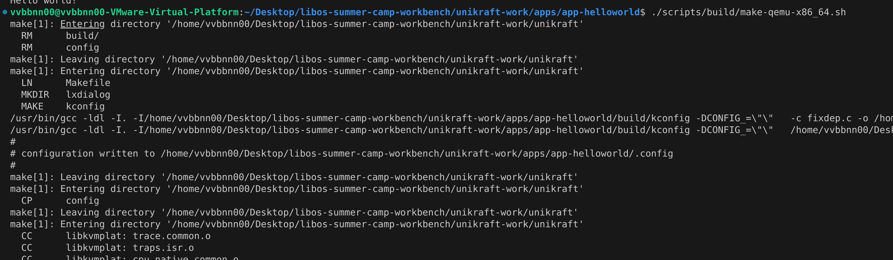
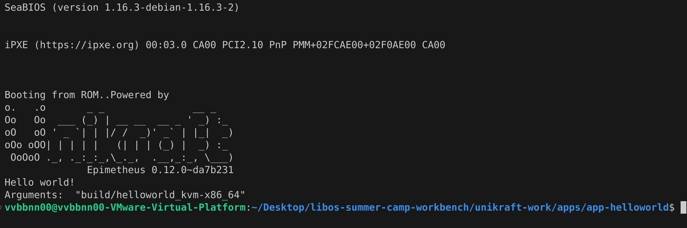
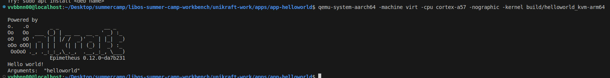
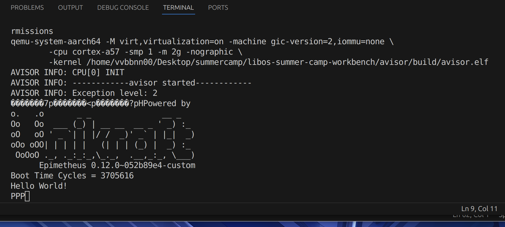

## Solution of Task1

### 提示
#### 1. 作为一个1型Hypervisor, 在缺少文件系统的情况下，Avisor是如何读取镜像文件的？

在Hypervisor级别，没有文件系统的概念，所有操作都是基于块设备的。
Hypervisor直接处理虚拟机对块设备的读写请求，将这些请求映射到实际的镜像文件的偏移位置进行操作。

在avisor的`vm.c`源代码中，`vm_init_mem_regions`函数负责将镜像文件从宿主机内存复制到虚拟机内存：

```c
static void vm_init_mem_regions(struct vm* vm, const struct vm_config* vm_config) {
    vaddr_t va;
    paddr_t pa;

    va = mem_alloc_map(&vm->as, NULL, vm_config->base_addr, NUM_PAGES(vm_config->size + vm_config->dmem_size), PTE_VM_FLAGS);
    if (va != vm_config->base_addr) {
        ERROR("va != vm's base_addr");
    }
    mem_translate(&vm->as, va, &pa);
    memcpy((void*)pa, (void*)vm_config->load_addr, vm_config->size);
    INFO("Copy vm%d to 0x%x, size = 0x%x", vm->id, pa, vm_config->size);

    va = mem_alloc_map(&vm->as, NULL, (vaddr_t)config.dtb.base_addr, NUM_PAGES(config.dtb.size), PTE_VM_FLAGS);
    if (va != config.dtb.base_addr) {
        ERROR("va != config->vm.base_addr");
    }
    mem_translate(&vm->as, va, &pa);
    memcpy((void*)pa, (void*)config.dtb.load_addr, config.dtb.size);
    INFO("Copy dtb to 0x%x, size = 0x%x", pa, config.dtb.size);
}
```

从代码分析来看，该函数将镜像文件从宿主机的内存地址复制到虚拟机的内存地址，并将虚拟地址转换为物理地址。这些操作通过调用`mem_alloc_map`和`mem_translate`函数实现。


#### 2. 在其他配置不更改的情况下，想要正确执行一个程序，第一步是什么？换句话说，第一个要知道的信息是什么？这一步在Avisor中是怎么体现的？

在执行一个程序的过程中，首先要了解的信息是程序的入口点（Entry Point），即程序开始执行的位置。在操作系统或虚拟化环境中，这通常是一个地址，指示程序在内存中的起始位置。

在`vm.c`文件中，初始化虚拟机的VCPU时，会设置入口点：

```c
void vm_vcpu_init(struct vm* vm, const struct vm_config* vm_config) {
    vcpuid_t vcpu_id = vm_calc_vcpu_id(vm);
    struct vcpu* vcpu = vm_get_vcpu(vm, vcpu_id);

    vcpu->id = vcpu_id;
    vcpu->p_id = cpu()->id;
    vcpu->vm = vm;
    cpu()->vcpu = vcpu;

    vcpu_arch_init(vcpu, vm);
    vcpu_arch_reset(vcpu, vm_config->entry);  // 这里设置了入口点
}
```

在这个函数中，`vm_config->entry`指定了程序的入口点。`vcpu_arch_reset`函数将这个入口点地址设置为VCPU的启动地址。


### 1. 为了完成这个任务,需要做哪些事情?

#### 熟悉Unikraft环境

1. 确保工作环境，此处使用的是 x86 架构的 Ubuntu24 系统，并安装了build-essental，qemu等必要的包

2. 切换到 unikraft-work 文件夹中，在 `apps/app-helloworld`中，根据指引，运行`./scripts/setup.sh`下载`unikraft`依赖包（但是这里下载的是最新版本，根据要求，我们需要用`0.12.0`版本，可以将对应版本的代码覆盖于此处）

3. 需要构建x86架构的程序，则使用`./scripts/build/make-qemu-x86_64.sh`，以此类推，可以构建各种各样的程序，如下图所示：


截图展示的是`x86`架构程序的编译过程。

4. 在运行时，可以使用`./scripts/run/qemu-x64_64.sh`来运行（但是实际操作时遇到了一些小问题，提示不存在程序文件，经过修改后可以正常运行，修改的代码如下）

```bash
#!/bin/sh

kernel="build/helloworld_kvm-x86_64"
cmd=""

if test $# -eq 1; then
    kernel="$1"
fi

# Clean up any previous instances.
sudo pkill -f qemu-system
sudo pkill -f firecracker
sudo kraft stop --all
sudo kraft rm --all

qemu-system-x86_64 \
    -kernel "$kernel" \
    -nographic \
    -m 64M \
    -append "$cmd" \
    -cpu max
```

运行后截图如下：


Arm64架构的运行截图如下：(需要事先安装`gcc-aarch64-linux-gnu`才能编译，同时需要安装`qemu-system-aarch64`)

值得注意的是，在该架构的运行过程中，不能用默认的配置（cpu参数为max），可以用如下指令运行，否则会卡死：

```qemu-system-aarch64 -machine virt -cpu cortex-a57 -nographic -kernel build/helloworld_kvm-arm64```



#### 在Avisor上执行helloworld
这一步骤较为简单，只需要在`avisor`目录中执行`make qemu`即可。



### 2. bin与elf的区别是什么?

我们通常在Unix或类Unix操作系统中使用的可执行文件格式是ELF格式。ELF文件具有严格的结构，包括文件头（ELF Header）、程序头表（Program Header Table）、节头表（Section Header Table）等部分，专门用于存储和管理可执行程序。

相比之下，bin文件泛指任何形式的二进制文件，内容和用途广泛，没有固定结构。在软件层面，bin文件可以看作是将ELF文件中的代码段、数据段等整合在一起的、可以被CPU直接执行的二进制文件。


### 3. qemu既然已经可以启动unikraft，那为什么还要在qemu之上实现一个avisor？

首先，关于avisor的开发意义，有如下原因：

1. 根据Avisor的介绍，它直接在裸金属硬件上运行，没有像 QEMU 那样的中间层（QEMU 是一个用户态进程，在主机操作系统上运行）。这种架构可以带来更少的开销和更高的性能，特别是在 I/O 和内存管理方面。
2. Avisor 专门设计和优化用于运行 unikernel，如 Unikraft。Unikernel 通常是单一用途的、小型的、性能优化的操作系统。Avisor 可以专注于提供必要的功能和优化，而不需要像 QEMU 那样支持广泛的操作系统和应用。
3. 同时，通过实现一个定制的 hypervisor，开发者可以完全控制 hypervisor 的行为和特性。这样可以更好地适应特定的硬件和应用场景，并且可以更快地引入和实现新的特性。

其次，在 QEMU 之上开发 Avisor ,有如下优势：
1. QEMU 提供了一个丰富的仿真环境，可以在不需要真实硬件的情况下进行开发和测试。同时，QEMU 支持多种调试工具，如 GDB，这些工具可以方便地用于调试 Avisor 的开发过程。通过 QEMU 的仿真环境，开发者可以在更可控的环境中排查和解决问题。
2. QEMU 支持多种架构和平台，包括 aarch64，这使得在不同的硬件平台上开发和测试 Avisor 变得更加容易。
3. 通过在 QEMU 上运行 Avisor，可以与其他虚拟化解决方案进行直接的性能对比和优化。这样可以验证 Avisor 的设计和实现是否达到预期的性能目标。同时，QEMU 提供的丰富特性和功能可以帮助验证 Avisor 的各种功能，包括设备管理、内存管理和 I/O 操作等。
