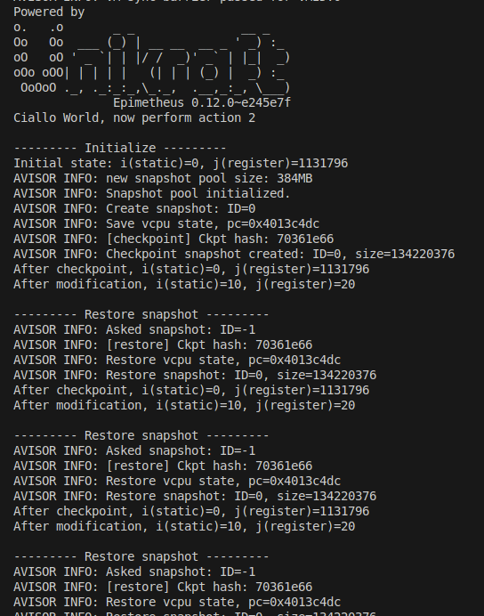
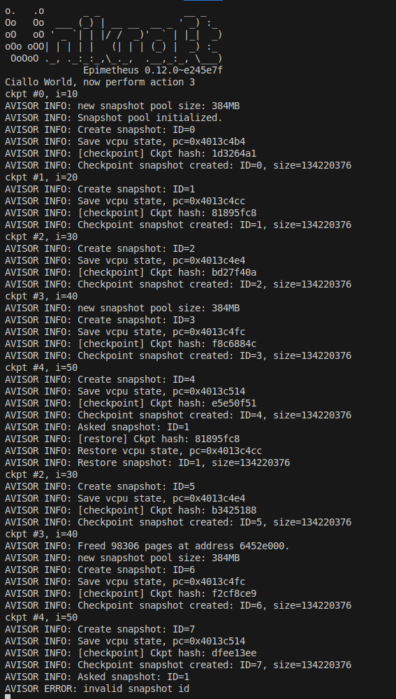

### Task3

#### 1. 快照实现思路

通常情况下，快照的功能是将当前系统的状态保存下来，以便在之后的某个时间点恢复到这个状态。需要保存的状态包括CPU的寄存器状态、内存内容、文件系统状态等等。不过，由于`Avisor`不存在文件系统，因此我们只需保存CPU的寄存器状态和内存内容。在`Avisor`中，我们可以通过`Hypercall`实现快照的功能。

当监听到来自虚拟机的特定`Hypercall`（在此项目中为`HYPERCALL_ISS_CHECKPOINT_SNAPSHOT`）时，我们可以将当前的CPU寄存器状态和内存内容保存下来。而当监听到另一个特定`Hypercall`（`HYPERCALL_ISS_RESTORE_SNAPSHOT`）时，我们可以将保存的快照恢复到当前状态。此`Hypercall`的`arg0`参数可以是`-1`表示恢复最近的快照，也可以是一个指定的快照ID表示恢复指定ID的快照。

#### 2. 创建快照的实现

快照实现的核心代码如下：

```c
// 创建快照的hypercall
void checkpoint_snapshot_handler(unsigned long iss, unsigned long arg0, unsigned long arg1, unsigned long arg2) {
    // ...
    // 1. 为快照分配内存空间
    ss = get_new_ss();
    if (ss == NULL) {
        ERROR("Failed to allocate memory for snapshot.");
        return;
    }
    
    ss->ss_id = get_new_ss_id();
    ss->size = sizeof(struct snapshot) + config->dmem_size;
    ss->vm_id = CURRENT_VM->id;

    // 2. 保存vcpu的状态
    memcpy(&ss->vcpu, cpu()->vcpu, sizeof(struct vcpu));

    // 3. 保存内存状态
    vaddr_t va = config->base_addr;
    pa = 0;
    mem_translate(&CURRENT_VM->as, va, &pa);
    if (pa == 0) {
        ERROR("Memory translation failed.");
        return;
    }
    memcpy(ss->mem, (void*)pa, config->dmem_size);

    // 4. 更新快照池的最后指针位置
    update_ss_pool_last(ss->size);

    // ...
}
```

从注释中可以看出，快照的创建分为四个步骤：首先为快照分配内存空间，然后保存`vcpu`状态，接着保存内存状态，最后更新快照池的最后指针位置。

#### 3. 恢复快照的实现

恢复快照的核心代码如下：

```c
void restore_snapshot_handler_by_ss(struct snapshot* ss) {
    // ...

    // 恢复内存状态
    const struct vm_config* config = CURRENT_VM->vm_config;
    vaddr_t va = config->base_addr;
    paddr_t pa = 0;
    if (!mem_translate(&CURRENT_VM->as, va, &pa)) {
        ERROR("Memory translation failed.");
        return;
    }
    memcpy((void*)pa, ss->mem, config->dmem_size);

    // 恢复vcpu的状态
    memcpy(cpu()->vcpu, &ss->vcpu, sizeof(struct vcpu));

    // ...
}
```

恢复快照的原理并不复杂，只需要将保存的`vcpu`状态和内存状态分别恢复到当前的`vcpu`和内存中即可。

#### 4. 多快照的实现

在原程序中，已经为多快照的实现做了铺垫。`snapshot`结构体中包含`ss_id`成员，用来标识快照的ID，同时，`get_new_ss_id`函数用于获取新快照ID，程序也实现了将快照加入到一个快照池的函数。

我们需要做的仅是在恢复快照时增加一个参数，用于指定恢复的快照ID。代码如下：

```c
// 恢复快照的hypercall
void restore_snapshot_handler(unsigned long iss, unsigned long arg0, unsigned long arg1, unsigned long arg2) { 
    // arg0: ssid, if arg0 == LATEST_SSID then restore the latest snapshot
    ssid_t ssid = arg0;
    struct snapshot* ss;

    INFO("Asked snapshot: ID=%d", ssid);

    if (ssid == LATEST_SSID) {
        ss = get_latest_ss();
    } else {
        ss = get_ss_by_id(ssid);
    }

    if (ss == NULL) {
        ERROR("No such snapshot. (ssid=%lu)", ssid);
        return;
    }

    restore_snapshot_handler_by_ss(ss);
    INFO("Restore snapshot: ID=%lu, size=%lu", ss->ss_id, ss->size);
}
```

在实现过程中，我发现`get_ss_by_id`函数存在一些缺陷，传入不存在的`ssid`时不会抛出异常，而是返回一个错误的内存地址。此外，我们补充了在快照池满时自动新建一个快照池，并在内存不足时释放最早快照池的功能。这部分在[额外的工作](../extra/extra.md)中有详细阐述。

#### 5. 快照系统的验证

在实现快照系统的过程中，我们可以通过`printf`打印不同的消息来观察快照系统是否成功。我设计了两个场景，一个是创建一个快照后恢复到该快照，另一个是创建多个快照后恢复到指定快照。

关于`Hypercall`的调用，我通过如下代码实现：

```c
#define HYPERCALL_ISS_CHECKPOINT_SNAPSHOT "1"
#define HYPERCALL_ISS_RESTORE_SNAPSHOT "2"
// ...
void hypercall_checkpoint_snapshot() {
    __asm__ __volatile__(
        "hvc #" HYPERCALL_ISS_CHECKPOINT_SNAPSHOT "\n"
        : // No output operand
        : // No input operand
        : "memory", "cc" // Clobbered registers
    );
}

// x0: snapshot_id
void hypercall_restore_snapshot(unsigned long snapshot_id) {
    __asm__ __volatile__(
        "hvc #" HYPERCALL_ISS_RESTORE_SNAPSHOT "\n"
        : // No output operand
        : "r"(snapshot_id) // Input operand list
        : "memory", "cc" // Clobbered registers
    );
}
```

##### 5.1 创建一个快照并恢复

该场景的核心实现代码如下：

```c
static int i = 0;
register int j = 0x114514;
printf("\n--------- Initialize ---------\n");
printf("Initial state: i(static)=%d, j(register)=%d\n", i, j);
hypercall_checkpoint_snapshot();
printf("After checkpoint, i(static)=%d, j(register)=%d\n", i, j);

i = 10;
j = 20;

printf("After modification, i(static)=%d, j(register)=%d\n\n", i, j);
printf("--------- Restore snapshot ---------\n");
hypercall_restore_snapshot(LATEST_SNAPSHOT);
```

为了验证快照恢复过程中能够完整恢复内存和寄存器数据，我们首先初始化了两个变量`i`和`j`，其中变量`i`是一个静态变量，存储在内存中，而变量`j`是一个寄存器变量，存储在寄存器中。

然后，我们调用`hypercall_checkpoint_snapshot`函数创建一个快照。接着修改变量`i`和`j`的值，调用`hypercall_restore_snapshot`函数恢复到最近的快照。

结果如下图所示：


可以看到，执行恢复快照的`Hypercall`后，`i`和`j`的值都恢复到创建快照时的状态，程序PC指针也恢复到创建快照时的位置（显示为不断循环恢复快照的过程），说明快照系统实现成功。

##### 5.2 创建多个快照并恢复

该场景的核心实现代码如下：

```c
static int current = 10;
        
// --- ckpt #0 ---
printf("ckpt #0, i=%d\n", current);
hypercall_checkpoint_snapshot();
// --- ckpt #1 ---
current = 20;
printf("ckpt #1, i=%d\n", current);
hypercall_checkpoint_snapshot();
// --- ckpt #2 ---
current = 30;
printf("ckpt #2, i=%d\n", current);
hypercall_checkpoint_snapshot();
// --- ckpt #3 ---
current = 40;
printf("ckpt #3, i=%d\n", current);
hypercall_checkpoint_snapshot();
// --- ckpt #4 ---
current = 50;
printf("ckpt #4, i=%d\n", current);
hypercall_checkpoint_snapshot();

// --- restore #1 ---
hypercall_restore_snapshot(1);
```

在该场景中，我们创建了5个快照，然后执行`hypercall`恢复到第2个快照（#1）。结果如下图所示：



可以看到，在创建快照过程中，由于将一个快照池的最大快照数设置为3，在创建第4个（#3）快照时，日志首先输出`AVISOR INFO: new snapshot pool size: 384MB`，说明成功创建了新的快照池。当恢复到#3快照时，第一次恢复成功并继续执行后续快照创建任务，说明多快照系统成功。值得一提的是，新创建的快照ID分别为5、6、7，说明快照ID不会因为新建快照池而重置（因为快照ID由Avisor管理）。再次恢复时系统提示`AVISOR ERROR: invalid snapshot id`，因为在创建快照#6过程中，系统提示`AVISOR INFO: Freed 98306 pages at address 6452e000`，说明由于内存不足系统自动释放最早的快照池，因此快照#1已被释放，无法恢复，提示无效快照ID。

具体情况如下：

```
格式：
快照池（px）：快照ID列表

从开始一直执行到 ckpt #4 时：
p0: 0 1 2
p1: 3 4

再次执行到 ckpt #2 时：
p0: 0 1 2
p1: 3 4 5

再次执行到 ckpt #3 时：
p0被释放
p1: 3 4 5
p2: 6

再次执行到 ckpt #4 时：
p1: 3 4 5
p2: 6 7

再次执行到 restore #1 时：
由于p0被释放，无法恢复到#1快照，提示无效快照ID
```
